> **fF**
## " You never know how strong you are until being strong is your only choice "

```mermaid
graph LR
A[Django] --> B[Full Stack Developer]
A --> C(Backend Developer)
B --> D{🌱🦉}
C --> D
```

> [!TIP]
> "It's just the waiting of one person." ❤🌱🦉

### OS

### Language

### Framework

### Database

### Tool

### Server

